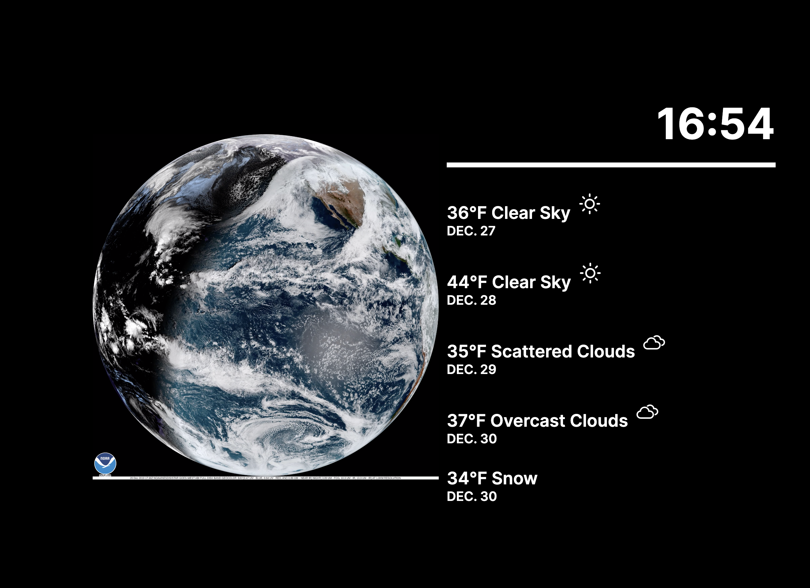

# Weather Dashboard with GOES-R imagery

This is very much a WIP project. The back-end sort of works, the front-end sort of works...

This project uses the following technologies:

- docker and docker-compose
- React
- GraphQL
- PostgreSQL
- Redis
- Minio (S3 storage)
- NASA Imagery
- Google Maps API
- OpenWeatherMap API

# WARNING

I haven't yet moved the APPID for the openweathermap API into a .env. For this release, I have just mangled that app id so I don't leak my credentials. You will need to replace it in order for the geolocation to work.

You'll also need to turn `.env-sample` into `.env` and then get your own Google Maps API key to put in there. The example one will not work.

# Basic Usage

If you just want to use this code to download images, you should `cd` into `/server/` install the requirements with `pip install -r requirements.txt` and then make sure you're running python3 (usage of f-strings). Then just run `python3 basic_image_tool.py` and it will grab the last 24 hours worth of imagery and create a video of it!

# TODO

1. Fix Minio setup
2. Get GraphQL subscriptions working correctly
3. Fix Weather widget (improve reliability)
4. Add Calendar widget
5. Deploy somewhere

### FFMPEG INFO

`https://github.com/jrottenberg/ffmpeg`

### Crontab entry

`*/10 * * * * cd /Users/Jeff/Code/experiments/dashboard && /Library/Frameworks/Python.framework/Versions/3.7/bin/python3 /Users/Jeff/Code/experiments/dashboard/image_tool.py`
